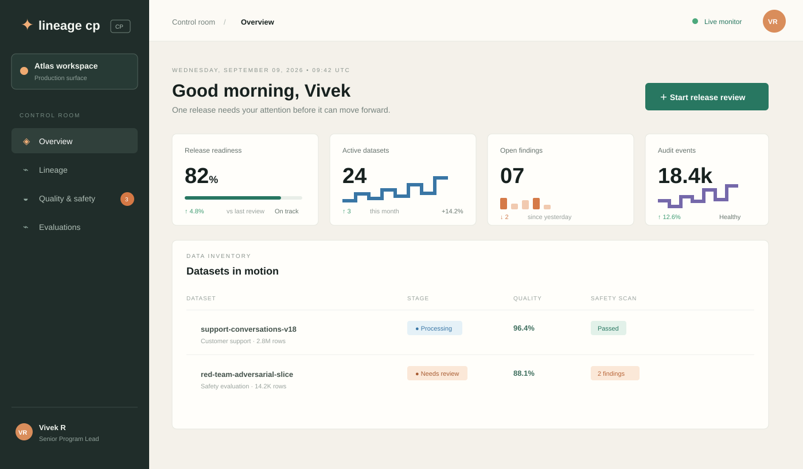

# AI Data Lineage Control Plane

A production-minded control surface for governing AI data, evaluations, safety findings, lineage, and release approvals.

## Dashboard preview



The dashboard is a responsive static application with no runtime dependency or backend requirement. It is designed as the operator surface for a larger governance platform and includes realistic release-control states and interaction patterns.

## What is included

### Release control

- Release readiness score with trend context
- Pipeline stages for ingest, quality, safety, approval, and release
- Human review gate for policy exceptions
- Approval state and blocking issue visibility

### Data governance

- Dataset inventory with stage, quality, and safety status
- Search across dataset names, including hyphenated identifiers
- Quality and compliance signals for operational review
- Immutable dataset versioning concepts and provenance context

### Safety operations

- PII and sensitive-content finding states
- Severity and confidence details
- Masking and exception review workflow
- Review drawer with acknowledge and dismiss actions

### Audit and evaluation

- Recent activity feed for governance events
- Audit event health indicators
- Model evaluation and benchmark status surfaces
- Lineage and policy navigation entry points

## Run locally

Requirements: Python 3.9+ or any static file server.

```powershell
cd C:\Dev\ai-data-lineage-control-plane
python -m http.server 8080
```

Open [http://localhost:8080](http://localhost:8080) in a browser.

You can also open `index.html` directly, although a local server is recommended for deployment parity.

## Project structure

```text
.
├── index.html                 Dashboard markup and accessible UI structure
├── styles.css                 Responsive visual system and layout
├── app.js                     Search, navigation, toast, and review interactions
├── docs/
│   └── dashboard-preview.svg  Repository-rendered dashboard preview
├── LICENSE
└── README.md
```

## Production deployment

The app is a static bundle and can be deployed to GitHub Pages, Cloudflare Pages, Netlify, an object-storage website, or an internal web server.

Recommended deployment settings:

- Serve `index.html` as the root document.
- Enable HTTPS and return `index.html` for the root route.
- Set long-lived immutable caching for `styles.css` and `app.js` after adding content-hash filenames in a build step.
- Add a strict Content Security Policy before connecting the UI to live services.
- Keep API tokens and governance credentials out of browser-delivered files.
- Replace demo data with authenticated API responses before production use.
- Add end-to-end coverage for release approval, finding acknowledgment, and policy-blocked states.

## Validation

The current implementation has been checked with:

- JavaScript syntax validation using `node --check app.js`
- Workspace diagnostics for HTML, CSS, JavaScript, and Markdown
- Browser smoke testing of the dashboard, review drawer, and dataset search
- Responsive layout behavior at desktop and mobile widths

## License

Apache License 2.0. See [LICENSE](LICENSE).
